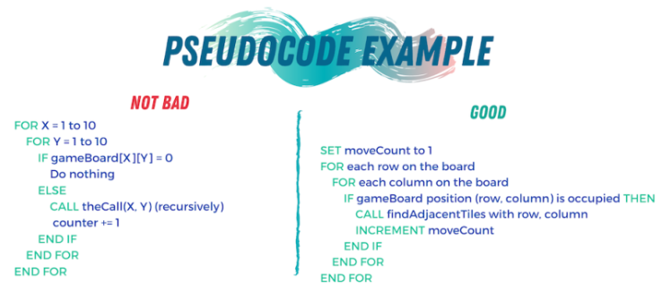

## Pseudocode: What It Is and How to Write It

- Pseudocode describes the distinct steps of an algorithm in a way that’s easy for anyone with to understand.

# THE MAIN CONSTRUCTS OF PSEUDOCODE

- At its core pseudocode is the ability to represent six programming constructs (always written in uppercase): SEQUENCE, CASE, WHILE, REPEAT-UNTIL, FOR, and IF-THEN-ELSE. These constructs — also called keywords —are used to describe the control flow of the algorithm.
- SEQUENCE represents linear tasks sequentially performed one after the other.
- WHILE a loop with a condition at its beginning.
- REPEAT-UNTIL a loop with a condition at the bottom.
- FOR another way of looping.
- IF-THEN-ELSE a conditional statement changing the flow of the algorithm.
- CASE the generalization form of IF-THEN-ELSE.

Example:

## How to Write Pseudocode

- When writing pseudocode, everyone has their own style of presenting since humans are reading it and not a computer; pseudocode’s rules are less rigorous than that of a programming language. However, there are some simple rules that help make pseudocode more universally understood.

### HOW TO WRITE PSEUDOCODE
- Always capitalize the initial word (often one of the main six constructs).
- Make only one statement per line.
- Indent to show hierarchy, improve readability, and show nested constructs.
- Always end multi-line sections using any of the END keywords (ENDIF, ENDWHILE, etc.).
- Keep your statements programming language independent.
- Use the naming domain of the problem, not that of the implementation. For instance: “Append the last name to the first name” instead of “name = first+ last.”
- Keep it simple, concise and readable.

Examples:

### Why Use Pseudocode?

IT’S EASIER TO READ
Often, programmers work alongside people from other fields such as mathematicians, managers and business partners. Using pseudocode to explain the mechanics of the code makes communicating between different specialties easier and more efficient.

IT SIMPLIFIES CODE CONSTRUCTION
When the programmer goes through the process of developing and generating pseudocode converting that into real code written in any programming language will become much easier and faster.

IT’S A GOOD MIDDLE POINT BETWEEN FLOWCHART AND CODE
Moving directly from the idea to the flowchart to the code is not always a smooth ride. That’s where pseudocode presents a way to make the transition between the different stages somewhat simpler.

IT’S A HELPFUL STARTING POINT FOR DOCUMENTATION
Documentation is an essential aspect of building a good project but starting documentation is often the most difficult part of the process. Pseudocode can represent a good starting point for what the documentation should include. Sometimes, programmers even include the pseudocode as a docstring at the beginning of the code file.

IT ALLOWS FOR QUICK BUG DETECTION
Since pseudocode is written in a human-readable format, it is easier to edit and discover bugs before actually writing a single line of code. We can edit pseudocode more efficiently than testing, debugging and fixing actual code.
